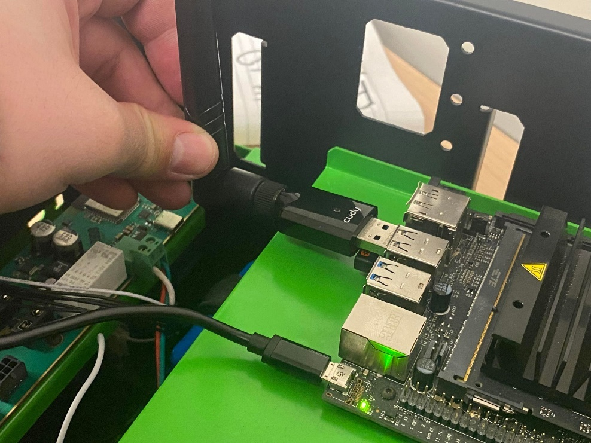
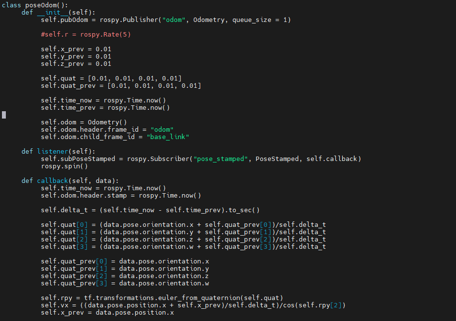
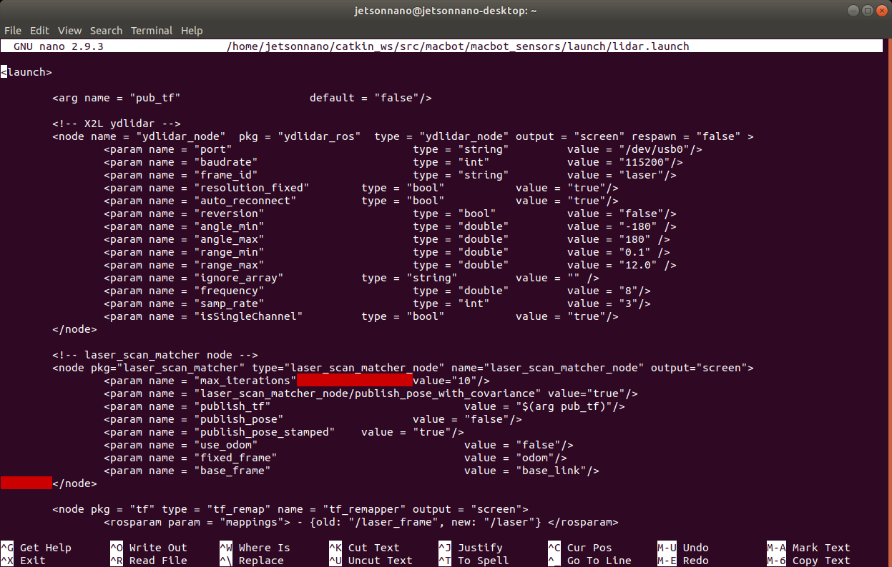
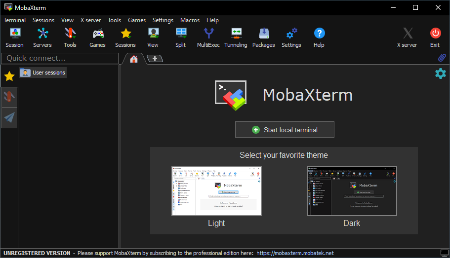
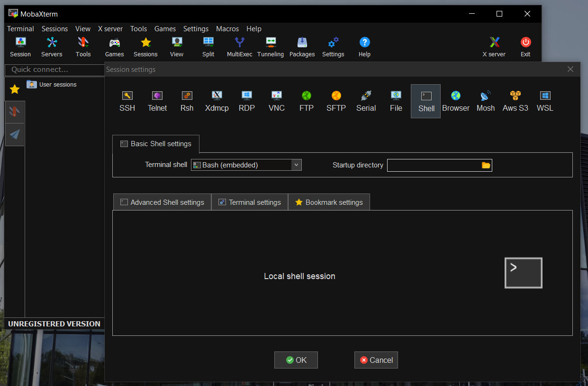

# Lab04\_Navigation

## Lab Downloads


PDF Format



WORD Format


Contents

Lab 4 – Navigation 2

Global Planner 2

Local Planner 2

Cost Maps 3

Understanding the move\_base Package 3

The MacBot Navigation Setup 4

Visualizing Path Planning in RViz 9

Next Steps 9

### Lab 4 – Navigation 

This lab will demonstrate path planning using the **amcl** and **move\_base** nodes. The primary function of the **move\_base** node is to traverse a robot from a current location to a goal location. This goal location will be set using RViz’s **2D Nav Goal** tool.

### Global Planner 

In order to navigate a robot from point A to point B, there are different strategies that can be used to calculate how to traverse that path. These are called path planning algorithms. Some popular examples are Dijkstra, A\*, D\*, and RRT. Applications like Google Maps use similar algorithms in order to optimize path planning and return the shortest route possible.

The move\_base node has three global planners:

1. **carrot\_planner** – Synonymous with ‘putting a carrot infront of the robot’, this strategy draws a direct path to the goal and ignores obstacles.
2. **Navfn** – Makes use of the Dijkstra’s algorithm to find a global path with a minimal cost.
3. **global\_planner** – A more flexible version of navfn that implements a variety of navigation algorithms.

All of the SLAM algorithms could comprise an entire course of content. Although this lab will not cover these algorithms, the reader is advised to briefly learn about Dijkstra and A\* specifically.

[http://ros-developer.com/2019/05/20/dijkstras-algorithm-with-c/](http://ros-developer.com/2019/05/20/dijkstras-algorithm-with-c/)

[https://realitybytes.blog/2018/08/17/graph-based-path-planning-a/](https://realitybytes.blog/2018/08/17/graph-based-path-planning-a/)

This lab will primarily focus on the **global\_planner** global planning package. The files are preconfigured so that they will use Dijkstra’s algorithm for global path planning.

### Local Planner 

Now that a global planner has been selected, one must strategize how to handle local obstacles. An example of this is a person walking in front of the robot or an obstacle being placed in front of it. A global planner would not be aware of the local obstruction and attempt to push through it in order to maintain the set trajectory. Alternately, a local planner working in conjunction with the global planner would be able to replan the blocked segment to navigate around the local obstacle.

The **move\_base** node has three local planners:

1. **dwa\_local\_planner** – Calculates the robot trajectory using velocity and angle. Evaluates which trajectory will keep it the most in-line with the global path.
2. **eband\_local\_planner** – Uses heuristics to model the change in trajectory as an elastic band.
3. **teb\_local\_planner** – ‘timed elastic band’ considers multiple trajectories in order to calculate the best solution.

This lab will proceed with the **dwa\_local\_planner**, which uses the **D**ynamic **W**indow **A**pproach (DWA) algorithm.

### Cost Maps 

Cost maps represent the cost (difficulty) of navigating to areas of the map. Just as there are global and local planners, there are also global and local cost maps. Cost maps represent areas of tolerance a robot is able to smoothly navigate, and they are used to guide and route a safe while efficient path.

.jpeg>)

In the image above, the local cost map is within the white diamond / square surrounding the MacBot. The global cost map is overlaid on top of the map.

The global planner will use the global cost map to generate the global (long-term) plan. The local planner will use the local cost map to generate their local (short-term) plan. The local cost map will use local sensor data to build their obstacle (cost) map.

### Understanding the move\_base Package 

Move\_base is a ROS package that coordinates between global planner and the local planner. This is implemented as a ROS Action server, with structured goal, feedback, and result messages as well as the ability to pre-empt goals. If one looks within the **\~/catkin\_ws/src/macbot/macbot\_navigation/config** directory, they will see a variety of parameter files. These files are for tuning the cost map and planners for both global and local maps. Knowing about the existence of these files becomes critical when tuning these planners for the robot’s particular environment and on-board sensors specifications.

.png>)

It is advised to read through the following guides before attempting to modify planning parameters. Changing these values could impact the expected movement of the robot. Ensure that the programmer has ample floor space to test.

[http://wiki.ros.org/navigation/Tutorials/Navigation%20Tuning%20Guide ](http://wiki.ros.org/navigation/Tutorials/Navigation%20Tuning%20Guide)[https://arxiv.org/pdf/1706.09068.pdf](https://arxiv.org/pdf/1706.09068.pdf)

### The MacBot Navigation Setup 

Running **rosrun rqt\_graph rqt\_graph** after the individual MacBot nodes have been started will display a high-level overview of the communication network between individual ROS nodes.

Since LiDAR is not a perfectly reliable source of odometry (its accuracy is affected by the material, colour, and shape of landmarks), getting autonomous path planning to work on the MacBot is challenging. In this case, a ROS node must be written to convert the laser scans from the LiDAR into usable odometry data.

laser\_scan\_matcher geometry\_msgs/PoseStamped nav\_msgs/Odometry

Create this node in the macbot\_sensors package and name it pose\_odom.py.

.png>)

.png>)

.png>)

.png>)

Odometry data is crucial for the **move\_base** to work. The move\_base package will later be sending **/cmd\_vel** messages to the differential drive controller, which will send the desired wheel spin rates to the macbot\_node from the previous lab.

Before getting started, there is a new flag that must be included when an attempt is made to SSH into the MacBot.

Old:

ssh [macbot@192.168.X.X](mailto:macbot@192.168.X.X)

New:

**ssh -X** [**macbot@192.168.X.X**](mailto:macbot@192.168.X.X)

This will enable X11 forwarding. An X-server is the display server that Ubuntu uses to display windows on a monitor. Forwarding this information allows RViz to be run graphically on a remote PC, which is an important tool for working with 2D pose data and navigation goals.

To get started, please launch the differential drive node:

**roslaunch macbot\_physical diff\_drive.launch**

Next, the LiDAR sensor must be launched. Ensure to pass **true** for the **pub\_tf** argument. Doing this will let the laser\_scan\_matcher node publish the TF link between odom and base\_link.

**Roslaunch macbot\_sensors lidar.launch pub\_tf=true**

Next, please launch **pose\_odom.py**. This node will be converting messages from laser\_scan\_matcher to odometry, as mentioned earlier. This is not the most accurate method of generating odometry data.

**rosrun macbot\_sensors pose\_odom.py**

Lastly, the nodes **move\_base** and **amcl** must be launched for path planning.

**roslaunch macbot\_navigation amcl\_macbot.launch**

Looking back at the VMWare Ubuntu desktop, please launch RViz. Select **Add** in the bottom-left area of the window. Navigate through the menu pop-up to select the desired visualization formats.

Take some time to try out and experiment with the various display types. They can be further configured in the left **Displays** column of RViz.

Feel free to include information regarding the global planners, local planners, and cost maps.

.png>)

Depending on the MacBot’s position within the map, publish a 2D pose update from the top toolbar so that the amcl is able to localize the robot within the generated map that was previously made.

### Visualizing Path Planning in RViz 

.png>)\

After publishing the navigation goal, a global plan will be generated within RViz. Soon after, the local plan will be generated as the robot begins detecting obstacles.

### Next Steps 

The next step is to attempt to optimize this navigation process. It is currently configured to navigate in a straight line. Extend this exercise by trying to optimize it so that it may navigate turns and smaller spaces more efficiently.
