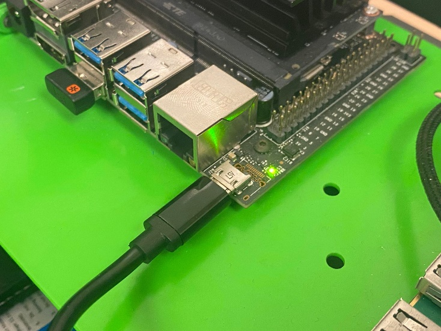
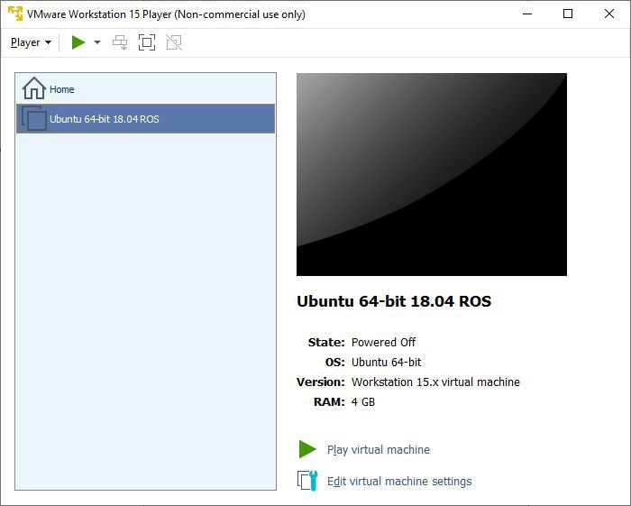
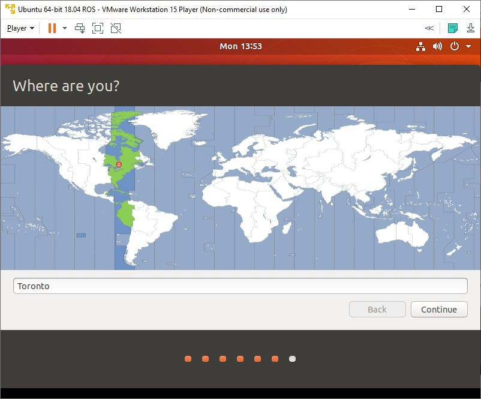
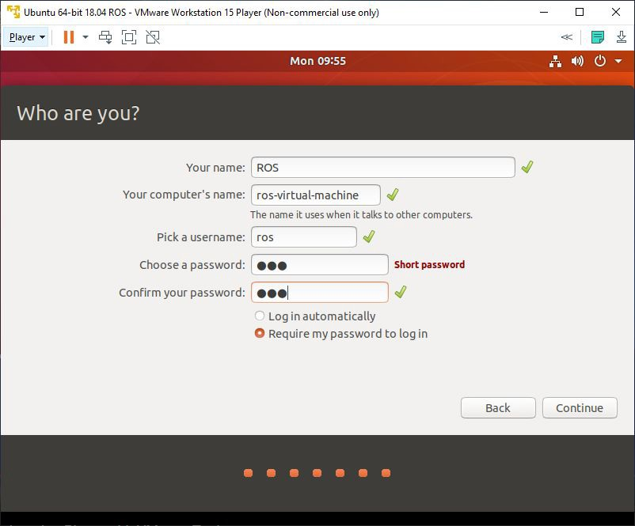

# Lab01\_Introduction

## Lab Downloads


PDF Format



WORD Format


Contents

Lab 1 – Introduction to ROS and Virtual Machines 2

Requirements: 2

Installing VMWare Workstation 2

Creating an Ubuntu 18.04 LTS Virtual Machine 2

Installing VMWare Tools on Ubuntu 11

Installing the Robot Operating System (ROS) 13

Setting Up the Jetson Nano VM Network 19

What is SSH? 19

Connecting 19

Working with the Robot Operating System (ROS) 21

Navigating ROS Commands 21

Creating a Package 22

ROS Graph Concepts 24

TurtleSim 24

Introducing rqt\_graph 26

Listing ROS Topics 27

### Requirements: 

### Installing VMWare Workstation 

[https://youtu.be/6ufEeFnLbxc](https://youtu.be/6ufEeFnLbxc)

### Creating an Ubuntu 18.04 LTS Virtual Machine 

For these ROS (Robotic Operating System) labs, a Linux-based Operating System will be required. Since many students will be running Windows or MacOS, you will be instructed on how to create a virtual machine on your host operating system.

**Download VMware Workstation** (free with McMaster ID, https://uts.mcmaster.ca/services/computers-printers-and-software/software-licensing/vmware-academic-program/) **** and install it on your system. The operating system image (.ISO) of Ubuntu 18.04 LTS is also required and may be downloaded from Canonicals’ website ([https://releases.ubuntu.com/18.04/](https://releases.ubuntu.com/18.04/)). Although more recent versions of Ubuntu exist, it must be ensured that they are compatible with ROS melodic ([https://www.ros.org/reps/rep-0003.html](https://www.ros.org/reps/rep-0003.html)). This is because ROS Melodic is currently the latest supported ROS release for the Jetson Nano and both ROS instances must be able to communicate with each other.

Please select the downloaded **Desktop image**.

On VMware Workstation, please select **Create a New Virtual Machine**. Then select "I will install the operating system later."

.jpeg>)

After you select **Next**, choose the following settings below:

Once you have the options selected, press **Next**. You can be creative with the name of your virtual machine. Please leave the location as the default (do not change it).

.jpeg>)

**40 GB** of space will be allocated for the Virtual Machine. Anything around 30 GB should be fine. Select "Store virtual disk as a single file".

Afterwards, a confirmation window will open. Click **Finish**.

Next, notice that the virtual machine has been added.

But before it can be run, it is important that you **Edit the virtual machine settings**.

Modify the **Memory** and **Processors** allocated. Please choose reasonable amounts as your system will be different. A rule of thumb is to allocate less than half of your base system’s CPU threads and RAM. In the **CD/DVD** setting, please **Browse** for the .ISO image we downloaded earlier. Now, begin booting the Virtual Machine. This is done by pressing **Play virtual machine**. The following window should pop up:

If prompted, install the latest version of VMWare Tools. Proceed by pressing **Download and Install**. Once updated, the boot process will continue and the following Welcome screen will be presented to you in VMWare Workstation Player.

Select **Install Ubuntu** and follow along the screen options. The install process is very intuitive.

Make sure to tick the bottom option **"Install third-party software for graphics and Wi-Fi hardware and additional media formats"**.

Since this is a virtual machine, it is isolated from your host operating system and the data on your computer. It is safe to ‘Erase disk and install’. Leave as default and **Install Now**. Another Window will popup, press **Continue**.

Choose your time zone. It would be your nearest major city. In our case, this would be Toronto, Ontario, Canada.

And finally, configure your Ubuntu credentials. A secure password is recommended. Press **Continue** when finished.

Finally, Ubuntu 18.04 LTS will begin installing on your virtual machine.

Once the installation is complete, please restart the VM.

Press **Restart Now**. A terminal window may appear with text running down your screen. Do not fret, this is normal. If you appear to be stuck within the VM and you cannot find your mouse. Press **Ctrl + Alt** to bring back your mouse.

**Power Off** the VM by pressing the exit button. After it has successfully powered off, please reboot the VM.

Log in and go through the first-time starting messages. Afterwards, you will be ready to work with Ubuntu!

### Installing VMWare Tools on Ubuntu 

VMware Tools is an add-on that will improve the ease of control over basic functions such as copying and pasting. With VMware open, click the top left **Player** > **Manage** > **Install VMware Tools**. After a short while, a directory will appear. Please double click on the directory. Copy this directory to your desktop.

On your desktop, right click the **VMwareTools.x.x.x-xxxx.tar.gz** file and extract it.

Go into the extracted **vmware-tools-distrib** folder. Next, **open** the folder in **Terminal**.

Once the terminal has appeared, run the following terminal commands:

**sudo chmod u+x vmware-install.pl**

chmod u+x will change the access permissions of the perl install script to be executable. The following command will execute that script.

**sudo ./vmware-install.pl -d**

Afterwards, you should see the following:

### Installing the Robot Operating System (ROS) 

To streamline the install process, an install script has been created for ROS that will download ROS and other dependencies that are required. It will also setup our ROS environment and catkin workspace.

Open **Terminal** by pressing the "Home" or "Windows" key and searching for it. You may alternatively use **CTRL + ALT + T**.

To download the script, use the following command.

**wget https://raw.githubusercontent.com/eechhx/install-ros-script/master/install\_ros\_jetson.sh**

Once downloaded, permissions must be modified to allow for executing.

**chmod u+x install\_ros\_jetson.sh**

Next, run the script using the following command.

**./install\_ros\_jetson.sh**

Ensure that the script runs to completion without any errors. Errors may prevent the build process of your catkin workspace and dependencies. Below, is the script in case that the source is no longer accessible, or you would like to use it for troubleshooting purposes. This was pasted on June 25th, 2021.

\#!/bin/bash

\#Author: Eech Hsiao

echo ""

echo "\[INFO] Required OS Version >>> Ubuntu 18.04 (Bionic Beaver)"

echo "\[INFO] Target ROS Version >>> ROS Melodic Morena"

echo "\[INFO] Catkin Workspace >>> $HOME/catkin\_ws"

echo "THIS INSTALL SCRIPT IS FOR DESIGNED SPECIFICALLY FOR McMASTER MACBOT JETSON NANO"

echo "IF YOU WANT TO CANCEL, PRESS \[CTRL] + \[C]"

read -p "PRESS ENTER TO CONTINUE"

ROS\_DISTRO=${ROS\_DISTRO:="melodic"}

name\_catkin\_workspace=${name\_catkin\_workspace:="catkin\_ws"}

echo "\[INFO] INSTALLING ROS"

echo "\[INFO] Written for MacBot // Ubuntu 18.04 // ROS Melodic Morena"

echo "\[INFO] Adding ROS Repository"

if \[ ! -e /etc/apt/sources.list.d/ros-latest.list ]; then

sudo sh -c 'echo "deb http://packages.ros.org/ros/ubuntu $(lsb\_release -sc) main" > /etc/apt/sources.list.d/ros-latest.list'

fi

echo "\[INFO] Downloading ROS Keys"

sudo apt-key adv --keyserver 'hkp://keyserver.ubuntu.com:80' --recv-key C1CF6E31E6BADE8868B172B4F42ED6FBAB17C654

echo "\[INFO] Downloading Intel RealSense Keys"

sudo apt-key adv --keyserver keys.gnupg.net --recv-key F6E65AC044F831AC80A06380C8B3A55A6F3EFCDE || sudo apt-key adv --keyserver hkp://keyserver.ubuntu.com:80 --recv-key F6E65AC044F831AC80A06380C8B3A55A6F3EFCDE

echo "\[INFO] Adding Intel RealSense Repository"

if \[ ! -e /etc/apt/sources.list.d/danielrichter2007-ubuntu-grub-customizer-bionic.list ]; then

sudo add-apt-repository "deb http://realsense-hw-public.s3.amazonaws.com/Debian/apt-repo bionic main" -u

fi

echo "\[INFO] Installing ROS and Other Packages"

sudo apt install -y \\

python-rosdep \\

apt-utils \\

librealsense2-utils \\

librealsense2-dev \\

ros-$ROS\_DISTRO-realsense2-camera \\

ros-$ROS\_DISTRO-teleop-twist-keyboard \\

ros-$ROS\_DISTRO-ros-controllers \\

ros-$ROS\_DISTRO-gmapping \\

ros-$ROS\_DISTRO-navigation \\

ros-$ROS\_DISTRO-urdf \\

ros-$ROS\_DISTRO-gazebo-ros \\

ros-$ROS\_DISTRO-xacro \\

ros-$ROS\_DISTRO-geometry \\

ros-$ROS\_DISTRO-geometry-msgs \\

ros-$ROS\_DISTRO-sensor-msgs \\

ros-$ROS\_DISTRO-image-transport \\

ros-$ROS\_DISTRO-dynamic-reconfigure \\

ros-$ROS\_DISTRO-diagnostic-updater \\

ros-$ROS\_DISTRO-nodelet-core \\

ros-$ROS\_DISTRO-camera-info-manager \\

ros-$ROS\_DISTRO-perception-pcl \\

ros-$ROS\_DISTRO-csm \\

ros-$ROS\_DISTRO-ros-base

\# Initialize and Update rosdep

if \[ ! -e /etc/ros/rosdep/sources.list.d/20-default.list ]; then

sudo rosdep init

fi

rosdep update

echo "\[INFO] Environment Setup"

source /opt/ros/$ROS\_DISTRO/setup.sh

printf "\nsource /opt/ros/$ROS\_DISTRO/setup.bash" >> $HOME/.bashrc

echo "\[INFO] Create Catkin Workspace"

mkdir -p $HOME/$name\_catkin\_workspace/src

cd $HOME/$name\_catkin\_workspace/src

catkin\_init\_workspace

cd $HOME/$name\_catkin\_workspace

catkin\_make

echo "\[INFO] Sourcing catkin\_workspace"

printf "\nsource \~/$name\_catkin\_workspace/devel/setup.bash" >> $HOME/.bashrc

echo "\[INFO] Fixing Gazebo REST Request Error"

sed -i -e 's,https://api.ignitionfuel.org,https://api.ignitionrobotics.org,g' \~/.ignition/fuel/config.yaml

echo "\[INFO] Git clone RealSense Gazebo / ROS"

cd $HOME/$name\_catkin\_workspace/src

wget https://raw.githubusercontent.com/eechhx/install-ros-script/master/\_d435.gazebo.xacro

wget https://raw.githubusercontent.com/eechhx/install-ros-script/master/\_d435.urdf.xacro

git clone https://github.com/pal-robotics/realsense\_gazebo\_plugin.git

git clone https://github.com/IntelRealSense/realsense-ros.git

echo "\[INFO] Moving and Replacing d435 Files"

mv -f $HOME/$name\_catkin\_workspace/src/\_d435.urdf.xacro $HOME/$name\_catkin\_workspace/src/realsense-ros/realsense2\_description/urdf

mv -f $HOME/$name\_catkin\_workspace/src/\_d435.gazebo.xacro $HOME/$name\_catkin\_workspace/src/realsense-ros/realsense2\_description/urdf

echo "\[INFO] Git clone diff\_drive ROS package"

git clone https://github.com/merose/diff\_drive.git

echo "\[INFO] Update and Upgrade Packages"

sudo apt-get update -y

sudo apt-get dist-upgrade -y

echo "\[INFO] Jetson Nano uses OpenCV4. Temp solution of downgrading to OpenCV3 for compatability with vision\_opencv/cv\_bridge \[melodic-branch]"

sudo apt -y --allow-downgrades install libopencv-dev=3.2.0+dfsg-4ubuntu0.1

sudo apt-mark hold libopencv-dev

echo "\[INFO] Finished Full Installation"

exit 0

### Setting Up the Jetson Nano VM Network 

#### What is SSH? 

SSH (**S**ecure **SH**ell) is a Network Protocol that allows one device (virtual machine) to connect to another device (MacBot) over a securely encrypted TCP/IP connection. This will be extremely useful for this set of labs where there is a need to remotely connect and interface with the MacBot. As long as the MacBot is connected to the same network as your PC, you will be able to access and modify the files through SSH.

Before SSHing into the Jetson Nano on the MacBot, the IP address of the device needs to be known. Connect a monitor to the Jetson Nano on the MacBot using HDMI and proceed to powering on and booting the MacBot’s Jetson Nano. Open the **Terminal** and run the following command:

**sudo ifconfig**

sudo stands for ‘superuser do’ and temporarily elevates the privileges of that command. It is the equivalent to ‘run as administrator’ on Windows.

ifconfig is a UNIX command that returns information regarding network interfaces that are being used. There are three interfaces that you are likely to see:

* eth0 - First ethernet interface. Any other would be designated eth1, eth2, etc.
* lo - Loopback interface. A special network interface that the OS uses to communicate with itself.
* wlan0 - First wireless network on the system. Subsequent interfaces designated as wlan1, wlan2, etc.

It is important that both your computer and your MacBot are connected to the **same** network. To elaborate, if your computer is using an ethernet connection, your MacBot must also be connected to the same ethernet network. The same applies when using WiFi.

This lab will proceed with using Ethernet for now. To do so, the eth0 address must be noted down:

**inet addr:192.168.1.9**

This is the IP address of the MacBot’s Jetson Nano and will be the address that is used to connect remotely via SSH.

Note: Your address will likely differ from this one.

Note: IP addresses are typically assigned dynamically. This means that there is no guarantee that if the MacBot disconnects and reconnects that it will keep the same IP address. If you have admin login credentials to the network, you may be able to assign a static IP address that does not change. Otherwise, just keep this in mind.

### Connecting 

Open the **Terminal** on the Ubuntu 18.04 LTS virtual machine.

To test if your VM is able to communicate to the MacBot’s Jetson Nano over the Ethernet network, use the ping command. The response time is echoed to the terminal window.

**ping 192.168.1.9**

As you can see, the VM is receiving a response of 64 bytes from the MacBot with the IP 192.168.1.9. Now, begin to SSH into the MacBot.

Format: #ssh username@ip\_address

**ssh macbot@192.168.1.9**

After entering your login password to the MacBot, you will notice that the terminal window is now connected to the Jetson. You can now access, navigate and modify the Jetson’s filesystem. But more importantly, you are able to run certain nodes without taxing the Jetson. Visualizing large amounts of data on the Jetson will produce significant performance issues. Doing this allows for the streaming of sensor data from the Jetson Nano to the VM. This data can further be visualized in the VM. This will be explored further in the upcoming labs.

### Working with the Robot Operating System (ROS) 

[https://youtu.be/FCsMMlYl9VA](https://youtu.be/FCsMMlYl9VA)

ROS(Robot Operating System) will be used in these labs. The liberty has already been taken in the previous section to install ROS and its required packages. There are many different distributions of ROS available, but this series of labs will be using Melodic Morena on Ubuntu version 18.04 LTS. Melodic Morena has an End-Of-Line (EOL) support date in 2023. This means that after 2023, transitioning to a newer version of ROS must be strongly considered since Melodic will no longer be receiving updates and security patches.

The “Robot Operating System” is not actually an operating system, but rather middleware that helps integrate the operating system and commonly used dependencies for the development of robotic systems. Note that there are many other different kinds of robotic platforms, but ROS is a popular open-source option. In being open-source, ROS it is constantly being improved and tested by the community and industry alike. It allows users establish an interface between hardware and software platforms, allowing for seamless integration of many distributed systems. A popular application of ROS in industry is in the rapid prototyping of complex systems.

ROS is packaged with many development tools such as rqt, RViz, and Gazebo. These tools allow for the visualization of the flow of information within ROS and help bring your code to life**.** We will be learning more about these tools as we progress through this series of labs.

Throughout this series of labs, the focus will not be about programming. Instead, we will focus in integrating and familiarizing ourselves with the ROS framework. We will assume that you have basic knowledge about Linux and the terminal.

#### Navigating ROS Commands 

It is important to first learn how to navigate the ROS filesystem to access packages. What is a package? Packages are units

of ROS code which have their own libraries, executables, etc. Being able to traverse in and out of these packages to access the files within is important for working with ROS. The focus of this section will be on covering the commonly used commands that allow the user to interact with ROS and ROS Packages.

* roscd : Allows the user to change directory to a package. Note that this also works for any subdirectories within the package!
  * **roscd macbot\_gazebo**
  * **roscd macbot\_navigation/launch**
* rosls : Lists the currently installed package. Also lists the subdirectories within an installed folder. This is useful for checking directories and files within a package without actually navigating to the package.
  * **rosls < TAB Twice>**
  * **rosls gazebo**

#### Creating a Package 

The ROS Workspace has already been configured through the previous ROS install script. This workspace is the directory where ROS packages will be compiled and executed from. It is actually possible have multiple catkin workspaces on one system, but this gets very complicated if you do not configure your workspaces correctly!

To create a package, **catkin** build tool will be used. It is the official build system for recent distributions of ROS. You may run into forum posts that speak about rosbuild or ament\_cmake. Please stay away from these and exclusively use catkin for the time being. Because various ROS packages may use different programming languages, tools, etc., ROS has their own custom build system. To understand the full scope of the catkin build system is beyond the scope of this series of labs. Instead, the focus will be put on learning how to utilize it.

First, before proceeding, the topic of sourcing the ROS environment should be touched upon. In order for ROS to work inside of your terminal, the terminal needs to know where ROS is installed, which installed version you are using, and where your catkin workspace is located in the Ubuntu filesystem. This is achieved through 2 commands that need to be entered every single time a new terminal window opens that you intend to use for ROS.

**source /opt/ros/melodic/setup.bash**

**source \~/catkin\_ws/devel/setup.bash**

This task can be automated by adding the set of commands into the **\~./bashrc** file. This is the terminal window configuration file, and it runs whenever a terminal window opens. Be careful making changes. It must be edited with sudo privileges.

**sudo nano \~/.bashrc**

Please scroll all the way down to an open line at the bottom.

Type the following commands:

**source /opt/ros/melodic/setup.bash**

**source \~/catkin\_ws/devel/setup.bash**

**echo “ROS Sourced!”**

Save the modified configuration file by pressing ctrl-s then ctrl-x.

Now, attempt to open a new terminal window and see that it prints “ROS Sourced!” on the first line. If there is an error, double-check the ROS installation paths, and the name and location of your catkin workspace.

Catkin packages are structured like this:

* Catkin\_package
  * CMakeLists.txt - Describes how to build the code and where to install
  * package.xml - Provides information about the package

Navigate to the source directory within the catkin workspace:

**cd \~/catkin\_ws/src**

The cd stands for “Change Directory”. The \~ represents the home directory. The forward slashes represent navigating through the hierarchy of the system directory.

The goal now is to create a custom ROS package. Verify that you are still positioned in the \~/catkin\_ws/src directory.

Please execute the command below. Dependencies are external libraries and tools that the package may sometimes need in order to function properly. In this case, 3 dependencies are required for this package to function correctly.

Format: catkin\_create\_pkg \<package\_name> \[dependency 1] \[dependency 2] \[dependency 3]

**catkin\_create\_pkg mypackage std\_msgs roscpp rospy**

Now that the ROS package has been created, navigate back to the root of the catkin workspace. This is at \~/catkin\_ws. Please run catkin\_make to rebuild the workspace.

**catkin\_make**

Alternatively, the ‘cd ..’ command could also be used to quickly navigate up a directory.

It will look something like this:

The **rospack** command can be used to see what dependencies are associated with a particular package.

**rospack depends mypackage**

This will show the following packages: roscpp, rospy, std\_msgs. All of which were included as a dependencies when creating the custom ROS package. Dependencies themselves will have their own dependencies, so feel free to check what those are and familiarize yourselves.

Navigate inside the mypackage directory and locate package.xml. Open this file in nano text editor.

**nano package.xml**

This series of labs will not cover the specifics so for further reading please visit the following website:

[http://wiki.ros.org/catkin/package.xml](http://wiki.ros.org/catkin/package.xml)

### ROS Graph Concepts 

This section will cover ROS nodes, topics, and messages.

**Nodes** can be thought of as processes. They communicate with each other through topics which can be messaged to and read from to exchange information.

**Topics** can be thought of as messaging channels that are used to exchange information between ROS nodes. The user interacts with topics through publish and subscribe routines.

**Messages** can be expressed through a wide variety of types. One example is std\_msgs::Twist which publishes velocity in JSON format. These messages are published to topics and accessed by the nodes that are subscribed to that particular topic.

An example of these three concepts working together could be a turtlebot. A package called teleop\_twist\_keyboard may publish std\_msgs::Twist messages over the topic /cmd\_vel. The differential drive ROS node will be subscribed to this topic and asynchronously actuate the motors based off of this data.

### TurtleSim 

TurtleSim is a ROS package that comes preinstalled with ROS. It is a great introductory learning tool that explores packages, nodes, and the communication between nodes.

ROS core will be ran frequently. This command starts the ROS master node, which tracks all of the ROS communication such as publishers and subscribers to the various active topics. These nodes will notify the master that it will publish or subscribe to various topics. Since it oversees the whole communication structure of ROS, it must always be running in order for us to be able to test or use ROS functionalities. Also, note that only one ROS core node should be active at one time. Multi-master networking is not covered in this series of labs.

**roscore**

The command rosrun allows one to run nodes from packages directly. **Open a new tab** (Ctrl + Shift + T) by pressing the top right new tab button and run the following commands to run the TurtleSim node:

Format: rosrun \[package] \[node]

**rosrun turtlesim turtlesim\_node**

Notice that the following window will open. The turtle will randomly generate, so do not fret if your turtle does not look like the one below.

Run the following command in a new sourced terminal window.

**rosnode list**

This command prints a list of the currently running ROS nodes. It is used frequently when troubleshooting or developing ROS systems. Next, the turtle\_teleop\_key ROS node must be launched.

**Rosrun turtlesim turtle\_teleop\_key**

This node allows for the user to control the position and movement of the turtle in the window. This is done in the terminal emulator window that the teleop node is launched from, using the arrow keys on the keyboard.

To exit the program, use **Ctrl + C** to interrupt cancel roscore or any of the ROS nodes that are active.

### Introducing rqt\_graph 

There are many tools within ROS that allow for the visualization of data and communication between nodes. Rqt\_graph is one of these tools. It breaks what is happening in the current ROS environment down into an easily readable chart.

**rosrun rqt\_graph rqt\_graph**

The following window should appear:

This visualizes both the teleop\_turtle and turtlesim ROS nodes. Turtlesim is subscribing to the ‘/turtle1/cmd\_vel’ topic which the teleop\_turtle node is publishing to.

Rqt\_graph is one of those tools that ROS developers find themselves using frequently in the troubleshooting process.

### Listing ROS Topics 

The rostopic tool allows the ROS developer to gain more insight into active topics.

**rostopic bw** # Displays bandwidth used by a topic

**rostopic echo** # Print messages to screen

**rostopic hz** # Display publishing rate of topic

**rostopic list** # Prints information about active topics

**rostopic pub** # Publish data to topics

**rostopic type** # Prints topic type

Once one begins implementing and working with a real physical platform with sensors and actuators, then these tools will become very helpful. However, in particular, the commands **rostopic list** and **rostopic echo** are the two most frequently used ones.
