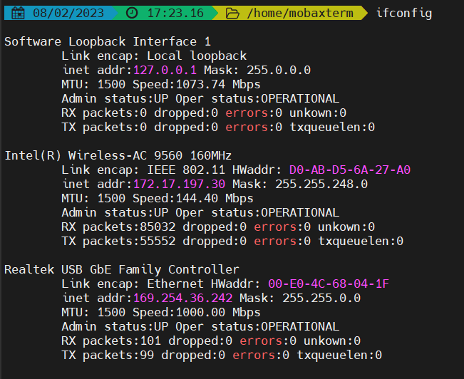
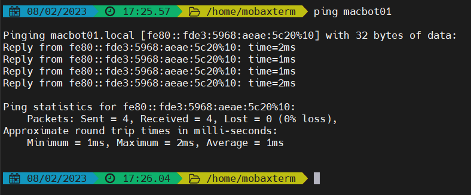
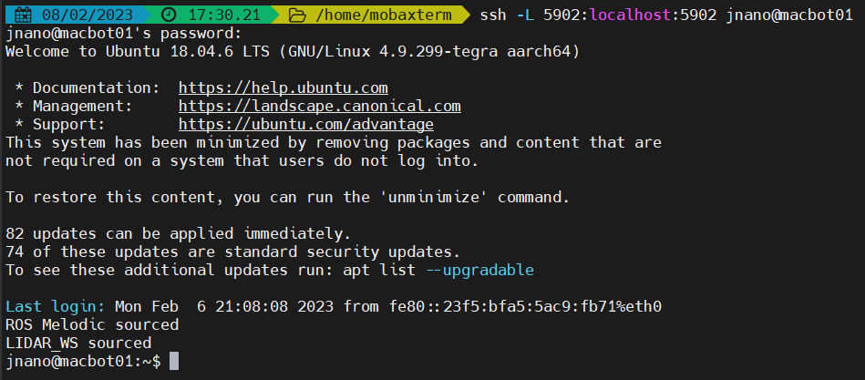
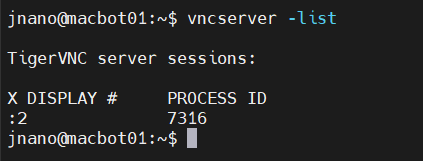

# Lab02\_RobotSetup

## Lab Downloads


PDF Format



WORD Format


Contents

Lab 2 – TF Tree and Robot Setup 2

Requirements: 2

Installing the YDLiDAR ROS Package 2

Setting Up the LiDAR Publisher Node 3

Setting Up the Motor Drivers and Distribution Board 4

Distribution Board 4

CAN Bus 5

Motor Drivers 7

Creating the ROS Python Node 9

Transform Broadcaster 11

Visualizing Odometry Data 13

### Requirements: 

* Completion of Lab 1
* Basic experience accessing machines over SSH
* Basic knowledge of PlatformIO

The purpose of this lab is to set up the LiDAR and use the laser\_scan\_matcher ROS package to get pose data. Pose is the combination of position and orientation data. It allows us to orient points in 3D space. We will also be interfacing with MacBot’s motors to drive it using our keyboard. This will be achieved by working with various nodes that will communicate using the MacBot’s CAN bus. In order to do so, we will need to write our own nodes that will help interface between ROS and the MacBot. We will be jumping back and forth between ROS and PlatformIO to cover all aspects of the MacBot relevant to the lab.

### Installing the YDLiDAR ROS Package 

Start your local virtual machine and log in.

SSH into the MacBot.

Ensure that the Git version control tool is installed. Do this by using the package manager.

**sudo apt install git**

.png>)

Next, open a new terminal window and navigate to **\~/\<catkin\_workspace\_name>/src.**

.png>)

Clone the YDLidar\_ROS remote github repository into your catkin workspace source folder using the following command.

**git clone https://github.com/YDLIDAR/ydlidar\_ros.git**

Build the workspace by changing to the workspace root directory **\~/\<catkin\_workspace\_name>** and running **catkin\_make**.

.png>)

### Setting Up the LiDAR Publisher Node 

Navigate to and open **\~/catkin\_ws/src/macbot/macbot\_sensors/launch/lidar.launch**

.png>)

Alternatively, if a GUI is preferred GEDIT or VSCode are great options.

.png>)

.png>)

First, the YDLIDAR node must be added in our launch file. Since there are different models of LiDAR available from this company, the parameters must be set as outlined in the README.md file located in the YDLidar\_ROS GitHub repository([https://github.com/YDLIDAR/ydlidar\_ros](https://github.com/YDLIDAR/ydlidar\_ros)).. The model provided is the **X2L LiDAR** and the parameters specific to this model must be configured according to the settings listed on the packages GitHub page One thing to keep in mind is that the **frame\_id** of the LiDAR node is changed to **/laser** in order to have a functioning TF Tree. A transform tree is another way of describing transforms that influence each other and branch out in a tree hierarchy.

\<node name = "ydlidar\_node" pkg = "ydlidar\_ros" type = "ydlidar\_node" output = "screen" respawn = "false" >

| \<param name = "port"                                          | type = "string" | value = "/dev/ydlidar"/> |
| -------------------------------------------------------------- | --------------- | ------------------------ |
| \<param name = "baudrate"                                      | type = "int"    | value = "115200"/>       |
| \<param name = "frame\_id"                                     | type = "string" | value = "laser"/>        |
| \<param name = "resolution\_fixed"                             | type = "bool"   | value = "true"/>         |
| \<param name = "auto\_reconnect"                               | type = "bool"   | value = "true"/>         |
| \<param name = "reversion"                                     | type = "bool"   | value = "false"/>        |
| \<param name = "angle\_min"                                    | type = "double" | value = "-180" />        |
| \<param name = "angle\_max"                                    | type = "double" | value = "180" />         |
| \<param name = "range\_min"                                    | type = "double" | value = "0.1" />         |
| \<param name = "range\_max"                                    | type = "double" | value ="12.0" />         |
| \<param name = "ignore\_array"                                 | type = "string" | value = "" />            |
| \<param name = "frequency"                                     | type = "double" | value = "8"/>            |
| \<param name = "samp\_rate"                                    | type = "int"    | value = "3"/>            |
| 
&#x3C;param name = "isSingleChannel"

&#x3C;/node>
 | type = "bool"   | value = "true"/>         |

.png>)

And as a reminder, in the **macbot\_description/urdf/robot\_textured.xacro** file, the LiDAR child link is referred to as:

\<joint type = "fixed" name = "lidar\_joint">

\<origin xyz = "0.0587 0 0.196" rpy = "0 0 0"/>

\<axis xyz = "0 1 0" />

**\<child link = "laser"/>**

\<parent link = "base\_link"/>

\</joint>

If one is not familiar with URDF linkages, please refer to the ROS WiKi.

More info: [http://wiki.ros.org/urdf/XML/joint](http://wiki.ros.org/urdf/XML/joint)

In short, they are the physical connections of the robot model that are actuated by joints. The **child** link points down the hierarchy of connections and the **parent** link points up the hierarchy.

.png>)

The advertised transform MQTT namespace could potentially just be renamed, but it allows us the opportunity to learn about **TF remapping.** TF remapping alters which topic transform data will be communicated over. This can be done by doing the following:

\<node pkg = "tf" type = "tf\_remap" name = "tf\_remapper" output = "screen">

\<rosparam param = "mappings"> - {old: "/laser\_frame", new: "/laser"} \</rosparam>

\</node>

More info: [http://wiki.ros.org/tf\_remapper\_cpp](http://wiki.ros.org/tf\_remapper\_cpp)

**Laser\_scan\_matcher** is a ROS node that uses data from the laser scan messages to estimate the robot’s position. The result is either a geometry\_msgs::**Pose2D** or **tf** transform. This node requires the **base\_link** **→ laser** transform that was configured in the robot\_textured.xacro file. It subscribes to **sensor\_msgs/LaserScan** messages, which the LiDAR node is publishing on the **/scan** topic.

More info: [http://wiki.ros.org/laser\_scan\_matcher](http://wiki.ros.org/laser\_scan\_matcher)

### &#x20;

### Setting Up the Motor Drivers and Distribution Board

CAN Bus is a message-based protocol that is typically used in vehicle systems. It allows for the communication between embedded devices without a master/slave relationship. Each node on the CAN bus can take on the responsibility of initializing a communication stream and act as a sender or receiver. On the MacBot, CAN is used in the communication between the Jetson Nano and the power distribution board. Two drive motors are then connected to this power distribution board. Because CAN bus is not native to the Jetson that is being used, a CAN gateway is placed as a translator between the Jetson Nano and the distribution board.

Motor Drivers → Distribution Board → CAN Gateway → Jetson Nano

#### Distribution Board 

The role of the distribution board is to distribute power and communicate with devices. It powers the motors and handles position feedback from the encoders. The development environment that will be used to program the distribution board is PlatformIO. PlatformIO is installed on top of existing editors and includes support for a wide variety of microprocessors and well as access to a large repository of compatible libraries. However, in this case some custom libraries will be used that cannot be found using the library manager.

.png>)

Please add the following libraries to the PlatformIO project:

1\. Arduino-GoLink (https://code.roboteurs.com/maciot-libs/arduino-golink)

2\. Arduino-ESP32-Encoder (https://code.roboteurs.com/maciot-libs/arduino-esp32-encoder) ‘

They are added by downloading and extracting each library. Then by dragging each library into the <**project\_name>/lib/** folder.

.png>)

The program that will be flashed to the microcontroller aboard the distribution board can be found here:

Distribution Board Code ([https://code.roboteurs.com/snippets/10](https://code.roboteurs.com/snippets/10)).

Connect to the board using USB-C.

Looking at the code, there is a **goLink** object called **myLink** that allows for communication with everything in our system.

When the myLink object is initialized, the bus speed must **ALWAYS** be **250E3**. A unique node ID must also be assigned. In this case, it is **node 2**. Every device on the CAN bus requires their own node ID so it can be addressed.

myLink.init(250E3, 2); myLink.setBroadcastRate(1000);

Next, the broadcast rate needs to be set. Since only basic diagnostic information like battery voltage is required from the distribution board, a high broadcast rate is not necessary. Set your broadcast rate to **1000 ms** (1s).

The code runs two concurrent tasks that are managed by the on-board RTOS. The first task, named **Task1code**, is pinned to one core and runs the **spin()** method. This method runs one messaging cycle. The second task is pinned to the other core on the dual-core ESP32 and is called **Task2code**. It sets 3 integer values to the queue that publishes to the CAN bus. Any node may have as many variables as they want but they must use different keys. However, different nodes may have the same variable as on a different node.

Ex. node 2 can have the can have a key called “v5” and node 8 can also have the same key “v5”

myLink.setInt("v5", analogRead(FIVE\_SENSE));

myLink.setInt("vb", analogRead(VBUS\_SENSE));

myLink.setInt("ib", analogRead(VBUS\_SENSE));

#### CAN Bus 

Navigate to an open directory and download the following: [https://code.roboteurs.com/maciot-libs/golink-env](https://code.roboteurs.com/maciot-libs/golink-env).

First, verify that python3 is installed on the macbot.

**sudo apt-get install python3 python3-pip**

Next, please navigate to **golink-env-master/extern/pybinn**. Manually install the python package using the following command:

**sudo python3 setup.py install**

Next navigate to **golink-env-master/extern/python-can-isotp**. And repeat the install process:

**sudo python3 setup.py install**

Finally, install the python-can package using the pip3 package manager:

**sudo pip3 install python-can**

Now that the CAN bus packages have been installed, navigate to **golink-env-master/utils**. Run the following command to verify the USB name:

**ls /dev | grep USB**

It will most likely read ttyUSB0. Linux represents devices as files on the filesystem. This simplifies the way that software exchanges information with devices.

Use nano to open the **golink-bus-init.sh** file and verify that the device reads:

**/dev/ttyUSB0** (or whichever device file it is for you).

Afterwards, run the script with sudo privileges:

**sudo ./golink-bus-init.sh**

Now that CAN bus is up and running, navigate to the golink library.

The scripts **goLinkManager.py** and a **main.py** should be visible. Please focus your attention on main.py.

Edit **main.py** to write a short script that will print out the power values that were established in the distribution node.

First, begin importing libraries:

import goLinkManager as glm

import time

import sys

Next, add the main method:

if name == “ main ”:

POWER\_DIST = 2

systemNodeIds = \[POWER\_DIST]

man.glm.GoLinkManager(systemNodeIds) man.startNodes()

while 1:

if man.isNewData(POWER\_DIST):

distDict = man.getData(POWER\_DIST) print(distDict)

Here, the code is polling the POWER\_DIST node. If new data is messaged, it will print that data.

Save, exit, and run the python script. Ensure that it is being run using Python 3.

**sudo python3 main.py**

#### Motor Drivers 

The motor driver code may be downloaded from [https://code.roboteurs.com/snippets/11/raw](https://code.roboteurs.com/snippets/11/raw). It must be uploaded to the motor drivers. Please direct your attention to the **Task2code** function. Notice the “**spr**” speed request variable, “**enc**” encoder variable, and lastly a “**spa**” speed actual variable.

Navigate to the setup function. Notice that the broadcast rate for myLink is set to **100 ms**. This ensures that the device is communicating with the distribution board and updating the drive motors more frequently. Set the CAN speed and node ID to that of the distribution board.

Connect to the board using USB-C.

**IMPORTANT - CHANGE THE NODE ID SO THAT BOTH MOTOR DRIVERS AREN’T ON THE SAME NODE IN THE LINE OF CODE: myLink.init(250E3, NodeID);**

**i.e. Left Motor Driver will have myLink.init(250E3, 4);**

**i.e. Right Motor Driver will have myLink.init(250E3, 5);**

Once both the motor drivers and distribution code have been uploaded, jump back to the Jetson Nano. Every time the Jetson Nano is booted, it is necessary to initialize the CAN bus by running the **golink-bus-init.sh** script. Please do so from the file’s directory. It will likely require root privileges to initialize correctly.

**sudo ./golink-bus-init.sh**

Back in **main.py**, quickly modify it so that the encoder values can be checked.

Next, add the motor driver code as follows:

if name == “ main ”: POWER\_DIST = 2

MOTOR\_DRIVER\_LEFT = 4

systemNodeIds = \[PWOER\_DIST, MOTOR\_DRIVER\_LEFT]

man = glm.GoLinkManager(systemNodeIds) man.startNodes()

while 1:

if man.isNewData(MOTOR\_DRIVER\_LEFT):

distDict = man.getData(MOTOR\_DRIVER\_LEFT) print(distDict)

Run the script using the following command:

**python3 main.py**

The following output will be seen:

{'enc': 0, 'spa': 0}

{'enc': 0, 'spa': 0}

{'enc': 0, 'spa': 0}

{'enc': 3, 'spa': 0}

{'enc': 8, 'spa': 0}

### Creating the ROS Python Node 

The next step is to create a ROS Python node that controls the MacBot’s drive motors. This requires accessing the CAN bus and running the differential drive ROS package ([https://github.com/merose/diff\_drive](https://github.com/merose/diff\_drive)).

**cd \~catkin\_ws/src**

**git clone** [**https://github.com/merose/diff\_drive.git**](https://github.com/merose/diff\_drive.git)

**cd ..**

**catkin\_make**

It is important to understand the communication structure this far:

**teleop-twist-keyboard (cmd\_vel) → diff\_drive (diff\_drive\_controller) → macbot\_node.py (custom) ↔ tf\_broadcaster.py (custom) ↔ motor\_drivers ↔ motors**

Using the **teleop-twist-keyboard** node, **std\_msgs::Twist** messages will be communicated over the **cmd\_vel** topic. These are velocity vector messages that will be used to update the speed of the drive motors. The **diff\_drive node** will subscribe to that **cmd\_vel topic** and publish **std\_msgs::Int32** messages to both the **lwheen\_desired\_rate** and **rwheel\_desired\_rate** topics. The custom macbot\_node that was previously written will then **monitor those topics and message** the motor speed to the distribution board using a speed request (spr). Concurrently, the macbot\_node will also be receiving encoder feedback from the motor driver. This data will be published to a topic. The **tf\_broadcaster** will then subscribe to this same topic and **publish the transforms**.

These transforms can then be visualized using the many tools built into ROS.

Please navigate to the macbot\_node ROS package and open **macbot\_physical/nodes/macbot\_node.py**.

The **shebang** is the first line in many python scripts. It determines where the python3 interpreter is located and allows the operating system to recognize it as a python script. This lets the user execute the script as a standalone executable, without needing to type python3. Because the GLM included library requires python3 for interfacing with CAN, the shebang will look like:

\#!/usr/bin/env python3

The dependent libraries must be imported into the project:

\#!/usr/bin/env python3 import rospy

import time

import goLinkManager as glm import signal

import sys

from std\_msgs.msg import (Int32, Float32)

The various nodes on the CAN bus must then be defined:

POWER\_DIST = 2

MOTOR\_DRIVER\_LEFT = 4

MOTOR\_DRIVER\_RIGHT = 5

systemNodeIds = \[POWER\_DIST, MOTOR\_DRIVER\_LEFT, MOTOR\_DRIVER\_RIGHT]

man = glm.GoLinkManager(systemNodeIds) man.startNodes()

Next, a class called macbotMotor is defined. In the future, this class may be renamed to reflect including other nodes besides motors. Do not fret if the class is named otherwise.

class macbotMotor():

def init (self, direction\_wheel): self.direction = str(direction\_wheel) self.direction\_check()

self.subTopicRate = str(direction\_wheel) + "\_desired\_rate" self.pubTopicTicks = str(direction\_wheel) + "\_ticks" self.pubTopicRate = str(direction\_wheel) + "\_rate"

self.subRate = rospy.Subscriber(self.subTopicRate, Int32, self.callback) self.pubTicks = rospy.Publisher(self.pubTopicTicks, Int32, queue\_size = 1) self.pubRate = rospy.Publisher(self.pubTopicRate, Float32, queue\_size = 1)

\# Drives motor\_driver via CAN def callback(self, data):

man.setData(self.motor\_driver, {'spr' : -data.data})

def direction\_check(self):

if self.direction == "lwheel":

self.motor\_driver = MOTOR\_DRIVER\_LEFT elif self.direction == "rwheel":

self.motor\_driver = MOTOR\_DRIVER\_RIGHT

def publishWheelData(self):

if man.isNewData(self.motor\_driver): self.distDict = man.getData(self.motor\_driver) self.pubTicks.publish(self.distDict\['enc']) self.pubRate.publish(self.distDict\['spa'])

Let us review the code. The **init** function acts as the constructor and initializes the class members after object creation. It performs a check to determine if the class is controlling the left or right drive motor on the **differential drive**. Next, topics are created for the node to publish and subscribe to. The name is determined by the **diff\_drive\_controller** node (**lwheel\_desired\_rate** and **rwheel\_desired\_rate**).

Upon subscribing to the wheel\_rate topic, a **callback** is invoked that sends a **speed request**(spr) on the CAN bus, which instructs the **motor\_driver** to innervate the motors.

Next is a function that publishes the **encoder**(enc) and **actual speed**(spa) of the drive motors.

In the main section of the code, the ROS node is initialized:

**Rospy.init\_node(‘macbot\_pubsub’, anonymous = True)**

Both the left and right drive motor objects of class macbotMotor are then instantiated. A super loop then repeatedly publishes drive motor speed data.

### Transform Broadcaster 

This is the first example in this set of labs that works with **ROS transforms**. An important note is that this node will be executed as a Python 2 script rather than Python 3 (unlike the macbot\_node). Because of this, the shebang will reference the Python 2 interpreter instead.

\#!/usr/bin/env python

import rospy

import tf\_conversions import tf2\_ros

import geometry\_msgs.msg from math import pi

from std\_msgs.msg import (Int32)

A class called **macbot\_tf\_broadcaster** that will be publishing the **tf** for both drive motors. Whether it is the left or right drive motor must be passed into the initializer.

class macbot\_tf2\_broadcaster():

def init (self, direction\_wheel):

self.br = tf2\_ros.TransformBroadcaster()

self.t = geometry\_msgs.msg.TransformStamped() self.direction = str(direction\_wheel) self.direction\_check()

self.t.header.frame\_id = "base\_link" self.t.child\_frame\_id = self.directionString + "\_wheel"

def direction\_check(self):

if self.direction == "lwheel": self.directionString = "left" self.t.transform.translation.x = 0.0753

self.t.transform.translation.y = 0.137

self.t.transform.translation.z = -0.004 elif self.direction == "rwheel":

self.directionString = "right" self.t.transform.translation.x = 0.0753

self.t.transform.translation.y = -0.137

self.t.transform.translation.z = -0.004

The **header frame** (or parent) will be the **base\_link**. In the same way as in the **macbot\_node**, a direction check must be done.

Because the link name in the **URDF.XACRO** is “**left\_wheel**” or “**right\_wheel**”, **self.directionString** must be set as “**left**” or “**right**”. Then the name of the child link must be called “**left\_wheel**” or “**right\_wheel**” when strings are added.

Some estimations must be done where the transform is published:

def publish\_tf(self, msg):

self.q = tf\_conversions.transformations.quaternion\_from\_euler(0, (360\*revs)\*(pi/180), 0)

self.t.transform.rotation.x = self.q\[0] self.t.transform.rotation.y = self.q\[1] self.t.transform.rotation.z = self.q\[2] self.t.transform.rotation.w = self.q\[3] self.br.sendTransform(self.t)

Because there are **\~1122 ticks per revolution**, the current encoder position must be divided by 1122. This finds the number of revolutions. Then, the remainder is used to determine the fractional percentage (between 0 and 1) of the wheel position.

revs = (-msg.data/1122.0) - int(-sg.data/1122)

This resulting decimal value is then converted into Radians.

if name == " main ":

rospy.init\_node('macbot\_tf2\_broadcaster')

left\_wheel\_tf = macbot\_tf2\_broadcaster("lwheel") right\_wheel\_tf = macbot\_tf2\_broadcaster("rwheel")

rospy.Subscriber("lwheel\_ticks", Int32, left\_wheel\_tf.publish\_tf) rospy.Subscriber("rwheel\_ticks", Int32, right\_wheel\_tf.publish\_tf)

rospy.spin()

In the main section, the node subscribed to “**lwheel\_ticks”** or “**rwheel\_ticks**” and the callback function is the **publish\_tf** method from the **macbot\_tf\_broadcaster** class.

### Visualizing Odometry Data 

The following screenshots only show the left wheel for tf\_broadcasting.

If everything is configured correctly, notice that the macbot\_tf\_broadcaster node is working correctly.

Multiple terminal windows will be required to run all of the required packages. This can be streamlined using a more advanced terminal emulator program. Two good options are deepin-terminal or terminator. Both are available in apt. They both offer the ability to split the terminal window horizontally and vertically. Deepin-terminal offers tabs. These must be installed on the local machine that will SSH into the MacBot.

Be sure that the terminal windows are SSH’d into the MacBot.

Now, the ROS packages are run on the MacBot (using SSH) and in the following order:

**roscore**

\*In tab #2

When roscore begins, run the following commands in order in the MacBot terminal to start the individual ROS nodes:

**roslaunch macbot\_sensors lidar.launch**

**rosrun teleop\_twist\_keyboard teleop\_twist\_keyboard.py**

**rosrun macbot\_physical macbot\_node.py**

**rosrun macbot\_physical tf\_broadcaster.py**

\*In tab #1

Run **RViz** on VMware and add the **RobotModel**, **/scan, LaserScan,** and **TF**. On the teleop terminal tab, decrease the speed with “Z” to around **\~0.09 m/s**. Next, drive the robot forward.

The wheels should spin based off of the **teleop\_twist\_keyboard** input.
