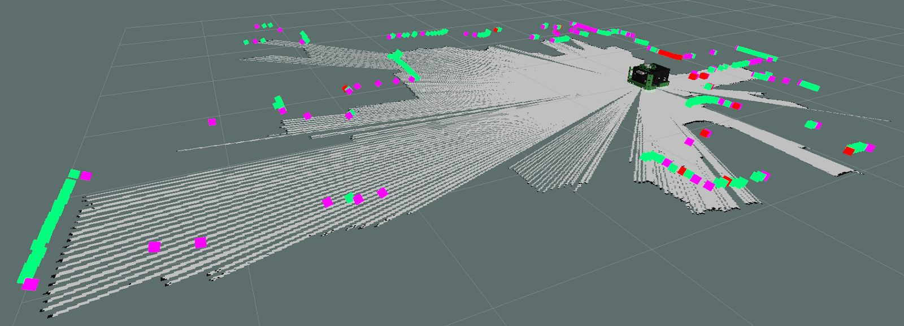
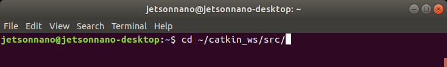

# Lab03\_Mapping

## Lab Downloads


PDF Format



WORD Format


Contents

Lab 3 – Mapping 2

SLAM 2

Mapping Launch Files 2

### Lab 3 – Mapping 

This lab will investigate 2D localization and mapping in a physical environment. The map will be built by driving the MacBot around and collecting data about the local environment using a laser scanner. Configuration parameters will be set in the launch file.

### SLAM 

SLAM – Simultaneous Localization and Mapping

SLAM is the process of collecting data about the robots’ position in an unknown environment using sensors and leveraging that data to make path planning decisions.

For example, say that a person wishes to walk from the Engineering Technology Building (ETB) to the Dave Bradley Athletic Centre (DBAC) but has no prerequisite knowledge of the campus environment. That person is likely to use a mapping tool like google maps. In this case, the **navigation goal** would be entered as DBAC. Google cloud would then use an **algorithm** to perform **path planning** in order to find the shortest route. In such a case, Google would be getting feedback through the global positioning system (GPS) on the persons smartphone. This data is used in the **localization** of the persons current position relative to its prebuilt map database.

For a robot to position itself in an environment, it needs the ability to detect and recognize recurring landmarks. This is done with sensors. In the example above, GPS and eyesight would have been used. In robotics, since GPS is not reliable in pinpointing location in some environments like indoors or near large buildings, this is typically achieved using LiDAR or camera technology. Odometry data is the estimate of the robot’s position and velocity in free space. For humans, this might be trivial, but robots require complex algorithms to produce and reason with odometry data.

### Mapping Launch Files 

Please launch the following:

**roslaunch macbot\_navigation gmap\_macbot.launch**

.png>)

The ydlidar node is already included in the launch file therefore it is unnecessary to launch the macbot\_sensors LiDAR node.

In the gmap\_macbot.launch file, the laser\_scan\_matcher node must also be launched.

There are parameters for the gmapping node that can be used to tune the mapping node to represent the local environment more accurately. An exercise is to practice tuning these parameters to achieve the best map possible.

Next, please include the following nodes to the diff\_drive launch file:

**\<node pkg = "macbot\_physical" name = "macbot\_node" type = "macbot\_node.py"/>**

**\<node pkg = "macbot\_physical" name = "tf\_broadcaster" type = "tf\_broadcaster.py"/>**

**\<node pkg = "teleop\_twist\_keyboard" type = "teleop\_twist\_keyboard.py" name = "teleop\_twist\_keyboard" output = "screen"/>**

.png>)

This allows for the launching of both the macbot\_node and tf\_broadcaster without needing to run additional launch commands. The teleop\_twist\_keyboard allows for the remote control of the macbot.

Next, please launch **diff\_drive.launch**.

