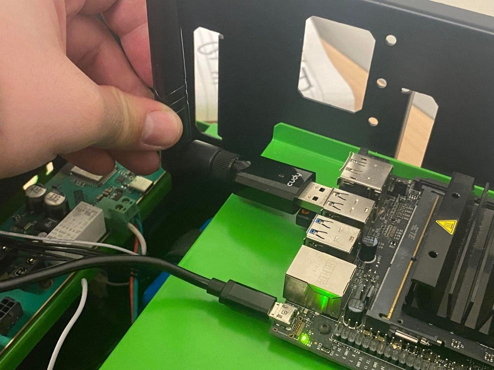

# LiDAR

## Lab Downloads


WORD Format


Introduction to Robot Operating System (ROS)

SEP 783 – Sensors & Actuators

_Adam Sokacz_

_Dr. Moein Mehrtash, LEL_

Group #:

First name, Last name, Student #

First name, Last name, Student #

First name, Last name, Student #

First name, Last name, Student #

Date:

### Objective 

To familiarize yourselves with Linux, the basics of ROS middleware, and be comfortable reading and visualizing LiDAR sensor data.

Table of Contents

Objective 2

Pre-Lab Questions 4

Post-Lab Questions 4

Optional Assignment 5

Feedback 5

MacBot Setup 6

Powering the MacBot 6

Connecting to the Internet 6

Connect Option #1 – Mouse and Keyboard 7

Connect Option #2 – Remote Connection 8

Creating a New Workspace 16

Installing The YDLidar SDK 19

Option #1 – Downloading from the Internet 19

PC Hotspot 19

Alternative – Connecting from the Terminal 23

Downloads 23

Option #2 – Sending from PC Over Ethernet 23

Building the YDLiDAR SDK 29

Building the ROS YDLiDAR Package 33

Capturing and Visualizing LiDAR Data 35

Connecting the YD LiDAR X2 35

Connecting to a Local Network 41

Updating Packages 42

Installing Deepin-Terminal 43

ROS Setup 45

Checking if ROS is Already Installed 45

Installing ROS Melodic 45

Creating a ROS Catkin Workspace 48

Lidar Setup 51

Cloning the YDLidar ROS Package 51

YDLiDAR SDK 52

Running the YDLidar ROS Package 59

Launch Files 59

Troubleshooting ROS Systems 65

### Pre-Lab Questions 

Q1 - What is _Ubuntu_? How is it different than _Windows_ or _MacOS_? How is it similar?

(Suggested: 3 sentences)

Q2 - What is the difference between _sudo apt update_ and _sudo apt upgrade_?

(Suggested: 1 sentence)

Q3 - What does the _sudo_ keyword to when using it in front of a terminal command?

(Suggested: 1 sentence)

Q4 - What is the bash command to navigate into a _directory/folder_? How do we list the _file contents_ of that folder?

(Suggested: 2 sentences)

Q5 - How do you create a _new file_ from the bash terminal?

(Suggested: 1 sentence)

### Post-Lab Questions 

Q1 - What is _Robot Operating System (ROS)_ in your own words? Search for and list _3 applications_ of ROS in industry.

(Suggested: Short paragraph)

Q2 - What does the GREP command do in Linux? Use an example in your explanation.

(Suggested: Short paragraph)

Q3 - What does the WGET command do in Linux? Use an example in your explanation.

(Suggested: Short paragraph)

Q4 - What is an SSH tunnel? Use a Bash command example in your explanation.

(Suggested: Short paragraph)

Q5 - What is a Daemon in Linux? Use an example in your explanation.

(Suggested: Short paragraph)

Q6 - What role does _ROSCore_ play in a functioning ROS system?

(Suggested: 1 sentence)

Q7 - What ROS command is used to _view_ the current active topics? Take a screenshot of the _current active topics_ on your system.

(Suggested: Screenshot)

Q8 - Which command was used to _echo_ that topic to the terminal? Pick the _LiDAR topic_ and echo it to the terminal.

(Suggested: Screenshot)

Q9 - Which command can be used to get _information_ on a particular topic? Use that command on the _LiDAR data topic_ and save a screenshot of your output.

(Suggested: Screenshot)

Q10 - What ROS tool can be used to _visualize_ a stream of data? Take a screenshot of the visualization of your LiDAR data.

(Suggested: Screenshot)

Q11 – Write a brief LinkedIn post about key concepts that were learned in this lab.

(Suggested: Brief Paragraph)

### Optional Assignment 

Follow the tutorial below to program and build a ‘Hello World’ publish and subscribe node in either Python or C++. Take a screenshot that captures the data being sent and received.

Python: [http://wiki.ros.org/ROS/Tutorials/WritingPublisherSubscriber%28python%29](http://wiki.ros.org/ROS/Tutorials/WritingPublisherSubscriber\(python\))

C++: [http://wiki.ros.org/ROS/Tutorials/WritingPublisherSubscriber%28c%2B%2B%29](http://wiki.ros.org/ROS/Tutorials/WritingPublisherSubscriber\(c%2B%2B\))

### Feedback

Q1 - What would you rate the difficulty of this lab?

_(1 = easy, 5 = difficult)_

| **1** | **2** | **3** | **4** | **5** |
| ----- | ----- | ----- | ----- | ----- |

Comments about the difficulty of the lab:

Q2 - Did you have enough time to complete the lab within the designated lab time?

Q3 - How easy were the lab instructions to understand?

_(1 = easy, 5 = unclear)_

| **1** | **2** | **3** | **4** | **5** |
| ----- | ----- | ----- | ----- | ----- |

List any unclear steps:

Q4 - Could you see yourself using the skills learned in this lab to tackle future engineering challenges?

_(1 = no, 5 = yes)_

| **1** | **2** | **3** | **4** | **5** |
| ----- | ----- | ----- | ----- | ----- |

### MacBot Setup 

### Powering the MacBot 

There are 3 ways to power the Jetson Nano for this lab:

* MicroUSB cable
* 5 W barrel connector
* Internal battery

To keep things straightforward, we will be using either of the **wired** options.

### Connecting to the Internet 

The MacBot does not have a built-in network adapter. This means that an external one must be purchased in order to gain WiFi access. Ensure that the adapter being used is Linux-compatible.

### Connect Option #1 – Mouse and Keyboard 

First, connect a monitor to the HDMI or **DisplayPort** port on the Jetson Nano.

Next, connect the power supply to the MacBot and watch it begin to boot into the graphical interface.

Lastly, connect a keyboard and mouse to the MacBot in order to interact with it.

.jpeg>)

**Login Info:**

_User:_ jnano

_Password:_ 9055259140

_Hint: The password is McMaster’s general phone number_

### Connect Option #2 – Remote Connection 

First, establish a network between the MacBot and your PC. The easiest way to accomplish this is through a wired ethernet connection using an **Ethernet-to-USB** **adapter**.

.jpeg>) .jpeg>)

Next, install the following software:

**MobaXTerm** Home Edition Portable ( [https://mobaxterm.mobatek.net/download-home-edition.html](https://mobaxterm.mobatek.net/download-home-edition.html) )

.png>)

Launch **MobaXTerm** as **Administrator**.

.png>)

First, we need to make sure we can see the **MacBot**. To do this, navigate to **Session > Bash Terminal**.

Press **OK**. A new bash terminal tab should open.

.png>)

Run the following command:

_Ifconfig_

This will show the available network interfaces.

The _Realtek USB GbE Family Controller_ is my USB-to-Ethernet adapter. The IP address listed **does not** represent the MacBot, it’s the adapter itself.

To check if the MacBot is connected, attempt to ping your MacBot. The MacBot I am using is **macbot01**.

_ping macbot01_

macbot01 is connected to my PC with the IP address of _fe80::fde3:5968:aeae:5c20%10._

Next, we will attempt to connect to the MacBot using a secure protocol called **secure socket shell**.

_ssh \<username>@\<ip\_address\_or\_pc\_name>_

_ssh jnano@macbot01_

We will use the **-L** flag to create an SSH tunnel between port 5902 of our PC and port 5902 of the MacBot to allow us to connect to the visual interface securely.

_ssh -L 5902:localhost:5902 jnano@macbot01_

If prompted, type **yes** and **\<enter>**.

The password is: **9055259140**, which is the general phone number for McMaster University.

While connected, we will launch a VNC server using the following command:

v_ncserver :2 -depth 24 -geometry 1920x1080_

To ensure that the server is running, we can use the following command:

_vncserver -list_

VNC port 2 is routed to 5900 + 2 = 5902, which is why we tunneled that port.

**Without closing the ssh tunnel**, open a new **VNC** tab in **MobaXTerm**.

Set the following configuration:

hostname: localhost

port: 5902

**Uncheck:** Use new embedded VNC engine.

Press **OK** and enter the password when prompted.

.png>)

A full desktop environment should be visible after a few moments of waiting.

It is suggested to click **Fullscreen**, then unselect **Stay on Top**. You should now be able to cycle through your windows using either the Windows key or **Windows + Tab**.

### Creating a New Workspace 

Navigate to the home/ directory using the following command:

_cd \~_

Create a new folder called **lidar\_ws/** with a subdirectory within it called **src/**.

_mkdir -p lidar\_ws/src_

_cd lidar\_ws/src_

Initialize the workspace using the following command from the **\~/lidar\_ws/src** directory:

_catkin\_init\_workspace_

A new file called **CMakeLists.txt** should have been generated.

Navigate to the **\~/lidar\_ws** directory and build the empty workspace using the **catkin\_make** command.

_cd \~/lidar\_ws_

_catkin\_make_

Notice that after the build is successful, some new directories have been generated. An important file is the **devel/setup.bash** script. We will need to load this script every time we open a new terminal emulator window in order to access workspace files when running ROS commands.

Use **gedit** as **superuser** to open the \~/.**bashrc** configuration script. This script runs each time a new terminal window is open. We will be appending commands to the **end** of bashrc to automatically source our ROS installation and workspace.

_sudo gedit \~/.bashrc_

_\<type\_password>_

Notice the #Sources section that was previously added. Ensure that you have these two paths sourced and echoed to the terminal window.

_# Sources_

_source /opt/ros/melodic/setup.bash_

_echo “ROS Melodic sourced”_

_source \~/lidar\_ws/devel/setup.bash_

_echo “\~/lidar\_ws sourced”_

Save and close the file.

Open a new teminal window.

You should notice the statements printing at the top of the window. **Close** the old window.

### Installing The YDLidar SDK 

### Option #1 – Downloading from the Internet 

If you have a WiFi adapter connected to your Jetson Nano, you can configure it to connect to either a PC hotspot or MAC\_WIFI.

#### PC Hotspot 

Open the Mobile Hotspot application on a personal laptop.

Configure a **unique SSID** and simple 8-digit password.

To avoid any compatibility issues, ensure that the **Network Band** is set to **2.4GHz**, and turn off **Power Saving** mode so the hotspot runs continuously. Toggle it **ON**.

To connect to it, we can use the **nm-connection-editor.**

Set the SSID and password.

Restart the network manager.

Wait **20 seconds** as your connection to the MacBot is temporarily interrupted.

Once the VNC starts responding again, attempt to **ping** google.com to verify that it has successfully connected to the internet. Give it a minute or two to connect if it fails the first time.

You should also see the connection on your mobile hotspot interface.

#### Alternative – Connecting from the Terminal 

sudo nmcli dev wifi connect \<ssid> password "\<password>"

sudo nmcli dev wifi connect \<GroupA> password "<12345678>"

_sudo service network-manager restart_

#### Downloads 

Download the following packages onto the MacBot.

[https://github.com/YDLIDAR/ydlidar\_ros\_driver](https://github.com/YDLIDAR/ydlidar\_ros\_driver)

[https://github.com/YDLIDAR/YDLidar-SDK](https://github.com/YDLIDAR/YDLidar-SDK)

_cd \~/lidar\_ws/src_

_git clone_ [https://github.com/YDLIDAR/ydlidar\_ros\_driver](https://github.com/YDLIDAR/ydlidar\_ros\_driver)

_cd \~/Documents_

_git clone_ [https://github.com/YDLIDAR/YDLidar-SDK](https://github.com/YDLIDAR/YDLidar-SDK)

### Option #2 – Sending from PC Over Ethernet 

Navigate to the following GitHub repository and download the package as **ZIP.**

[https://github.com/YDLIDAR/ydlidar\_ros\_driver](https://github.com/YDLIDAR/ydlidar\_ros\_driver)

[https://github.com/YDLIDAR/YDLidar-SDK](https://github.com/YDLIDAR/YDLidar-SDK)

The files have both been downloaded into your PC’s **Downloads/** folder.

View the path and the name of the files you wish to transfer over.

Here are the file transfers:

**LiDAR SDK:** _“C:\Users\Adam\Downloads\YDLidar-SDK-master.zip” /home/jnano/Documents_

**LiDAR ROS:** _“C:\Users\Adam\Downloads\ydlidar\_ros\_driver-master.zip” /home/jnano/lidar\_ws/src_

You can do this using SFTP from within MobaXTerm, but I think the least complicated way is to just use a USB thumb drive and copy the files to it.

Drag and drop the files to their correct locations within VNC.

### Building the YDLiDAR SDK 

Verify that the SDK has been successfully extracted into the **/home/jnano/Documents** folder.

Open a terminal window and navigate to this Directory.

Make a directory called **build/**.

_mkdir build_

_cd build_

If you run **cmake** without any command line arguments, it will give your more information on what the program requires to prepare the build for a project.

In our case, the **build/** directory is our target and the source is the **YDLidar-SDK-master** directory which is one level above.

Run **CMake** to build the SDK into the **build/** directory.

Ensure that build files have been generated correctly.

Next, run the **make** command to compile the project using those generated build files.

Ensure it builds without fatal errors.

But in our case, we want to use this SDK from our ROS workspace.

We need to give ROS access to this SDK.

This can be done using the **sudo make install** command, which copies all the binaries to appropriate locations in the operating system, where other programs can access them.

### Building the ROS YDLiDAR Package 

Navigate into your **\~/lidar\_ws/src** directory.

Use the **mv** command to rename the ROS LiDAR driver package to **ydlidar\_ros\_driver**.

Build the workspace using **catkin\_make** from the **\~/lidar\_ws** directory.

Ensure that the build was successful.

### Capturing and Visualizing LiDAR Data 

### Connecting the YD LiDAR X2 

### Connecting to a Local Network 

Back in Ubuntu, **select** the hosted WiFi network.

### Updating Packages 

Using the launch menu, open the **Terminal**.

Run the following command:

_sudo apt update_

### Installing Deepin-Terminal 

When working with ROS, it is useful to be able to split a terminal window into multiple horizontal and vertical windows or create new terminal tabs. This is because ROS requires many scripts to run concurrently and navigating between many open windows becomes tedious and difficult to navigate.

_sudo apt install deepin-terminal_

To split deepin-terminal, **right-click** and select either **Horizontal split** or **Vertical** split. To create a new terminal tab, **click** on the **+** new tab button.

### ROS Setup 

### Checking if ROS is Already Installed 

_rosversion -d_

If an error prints, ROS needs to be installed. Please continue with the installation instructions.

### Installing ROS Melodic 

_sudo sh -c 'echo "deb http://packages.ros.org/ros/ubuntu $(lsb\_release -sc) main" > /etc/apt/sources.list.d/ros-latest.list'_

_sudo apt install curl_

_curl -s https://raw.githubusercontent.com/ros/rosdistro/master/ros.asc | sudo apt-key add –_

_sudo apt update_

_sudo apt install ros-melodic-desktop-full_

Now, in order to have access to ROS commands without needing to source the installation each time a terminal window is opened, we can add it to the **\~/.bashrc** file.

_sudo nano \~/.bashrc_

Add the source for ROS melodic.

_source /opt/ros/melodic/setup.bash_

To exit nano, use the following commands:

CTRL + s

_CTRL + x_

_Y_

_\<Enter>_

_Open a new terminal window and see if any errors occur. Is an error does occur, ensure that the correct path was added to the bashrc file._

Next, install useful dependencies for ROS Melodic.

_sudo apt install python-rosdep python-rosinstall python-rosinstall-generator python-wstool build-essential_

Lastly, initialize rosdep.

_sudo apt install python-rosdep_

_sudo rosdep init_

_rosdep update_

### Creating a ROS Catkin Workspace 

Create a new directory in your **home/** folder and initialise it as a catkin workspace.

_cd \~/_

_ls_

_mkdir lidar\_ws_

_cd lidar\_ws_

_mkdir src_

_catkin\_make_

If you look inside the generated **devel/** folder, you will find a **setup.bash** file. This file must be used to source the director.

Open the \~/.**bashrc** folder, scroll to the bottom and source this file.

_sudo nano \~/.bashrc_

Add the following lines:

_source \~/lidar\_ws/devel/setup.bash_

_echo “LIDAR\_WS sourced”_

Save the file using the following commands:

_CTRL + s_

_CTRL + x_

_Y_

_\<Enter>_

Open a new terminal window. Ensure that everything sources without any errors.

### Lidar Setup 

### Cloning the YDLidar ROS Package 

_cd \~/lidar\_ws/src_

_git clone https://github.com/YDLIDAR/ydlidar\_ros\_driver.git_

Navigate back to **\~/lidar\_ws.**

You will notice that if you build this project now, it will state that dependencies are missing. In order to resolve this, we must download and build the YDLiDAR SDK package.

### YDLiDAR SDK 

Navigate to the following GitHub repo:

[https://github.com/YDLIDAR/YDLidar-SDK](https://github.com/YDLIDAR/YDLidar-SDK)

Copy its git URL.

In order to build a C++ project, you will need to ensure cmake is installed.

s_udo apt install cmake pkg-config_

**Clone** the repo into your **\~/Documents** directory.

Navigate into the cloned repo and create a new folder called **build/**.

Navigate into the **build/** directory.

If you run **cmake** without any command line arguments, it will give your more information on what the program requires to prepare the build for a project.

In our case, the **build/** directory is our target and the source is the **YDLidar-SDK** directory which is one level above.

Run CMake to build the SDK into the build/ directory.

If it is able to traverse the project correctly, it should print an overview of the generated build configuration.

Next, **make** the SDK while being in the **build/** directory.

If the build is successful, many files should be generated including some test examples for working with the SDK.

But in our case, we want to use this SDK from our ROS system using the **ydlidar\_ros\_driver**. We need to give that ROS package access to this SDK. This can be done using the **make install** command, which copies all the binaries to appropriate locations in the operating system, where other programs can access them.

Once the SDK has been installed correctly, navigate back to your ROS workspace.

### Running the YDLidar ROS Package 

Now that the SDK has been installed, the ROS package should build correctly.

Navigate into the root of the **lidar\_ws workspace** and run **catkin\_make**.

### Launch Files 

ROS projects can become very sophisticated, having many nodes communicating concurrently. A way to automate the startup of a program is to use a launch file.

Navigate to the **launch/** directory of the built **ydlidar\_ros\_driver** ROS package.

Lets open the **X2.launch** file in a text editor to view how it works. Use **nano** to view in-terminal or **gedit** to view in a graphical editor.

Notice that between the **\<launch>** XML tags, the **ydlidar\_lidar\_publisher** node is started. Next, a lot of ROSParameters are set that contain the LiDAR communication configuration for the X2 lidar. Lastly, two transforms are created that will provide a reference point when visualizing the LiDAR point-cloud.

Before launching the **X2.launch** file, start ROSCore in a new terminal window.

ROSCore is a daemon that allows different ROS nodes to communicate with each other. It needs to be running for any ROS node to run. If one isn’t already running, the system will begin ROSCore automatically in another thread.

Launch the launch file. There are two ways to do this. If you are not in the same directory, you can use the following command:

Ensure that the LiDAR initializes correctly. You should hear it’s fast spinning change to a more constant humming.

### Troubleshooting ROS Systems 

To get a current overview of the ROS system, use the **rosgraph** command in a new terminal window.

To list the active ROS topics, use the **rostopic list** command.

With the LiDAR running, you should see a **/scan** topic.

To find more info on the data being transmitted on this topic, use the **rostopic info** command.

The data structure used for this topic is **sensor\_msgs/LaserScan** and the active publishers are **/ydlidar\_lidar\_publisher** on ROSCore port **40563**.

Next, lets see what raw data is being sent on this topic. This can be done using the **rostopic echo** command.

To exit the echo mode, press **CTRL + c** on your keyboard.

1. How is Linux installed?
2. Connecting and logging in
3. Using the Terminal to install update packages
4. Navigating the filesystem
5. Creating and editing files from the terminal, GEdit, and VSCode
6. Installing ROS
7. ROS Commands
8. Installing the YDLidar ROS package
9. Connecting the YDLidar
10. Visualizing the YDLidar
